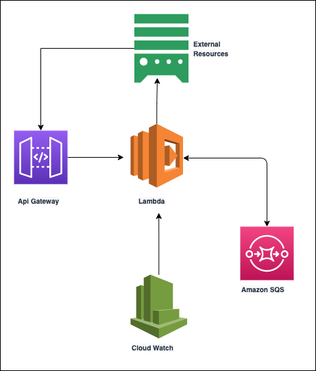

# Challenge linkapi

Serviço de integração pipedrive com bling.

## Installation

 - Node.js v12+ [install](https://nodejs.org/en/download/)
 - AWS CLI [install](https://docs.aws.amazon.com/cli/latest/userguide/cli-chap-install.html)
 - Serverless.js [install](https://www.serverless.com/framework/docs/getting-started/)

## Configuration
- Criar `access-key-id` and `secret-access-key` na aws [link](https://aws.amazon.com/blogs/security/wheres-my-secret-access-key/)

- Configurar credentials no serverless.js [link](https://www.serverless.com/framework/docs/providers/aws/cli-reference/config-credentials/)

### Environment
- `PIPEDRIVE_TOKEN`: Token de aplicação do pipedrive
- `BLING_TOKEN`:  Token de aplicação Bling
- `DEBUG`: Logs da aplicação
- `MONGO_URL`: Url de conexão com o mongoDB

## Architecture



## Execution

 Download das dependências

```bash
  yarn install
```

Executando localmente

```bash
  yarn dev
```

Deploy do serviço na AWS

```bash
  yarn deploy
```

## Documentation
Documentação das apis pode ser consultada no swagger em `http://localhost:3000/dev/api-docs`.


